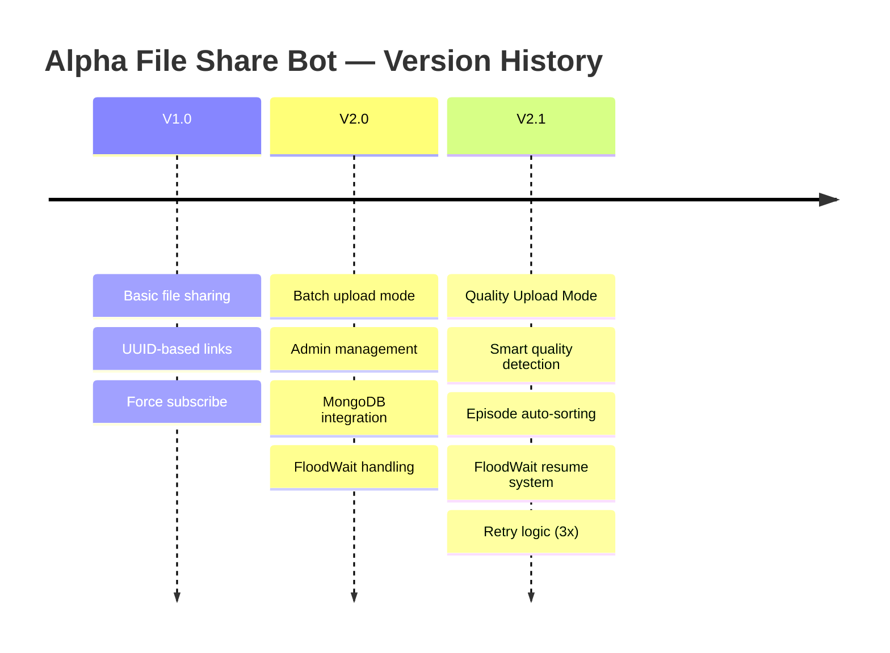
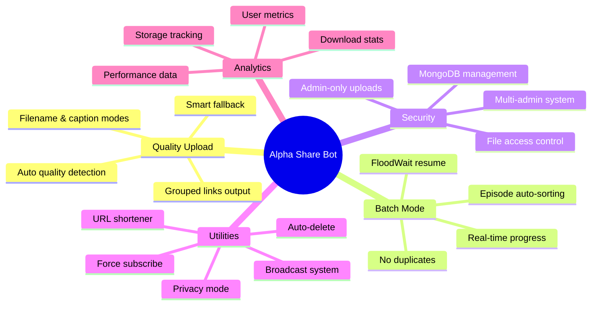
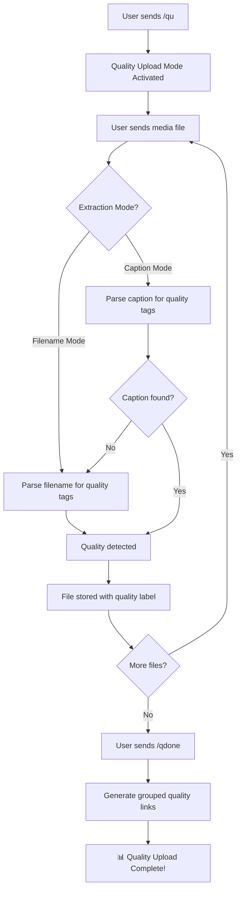
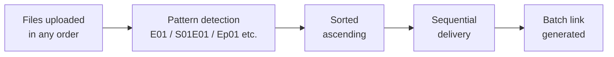
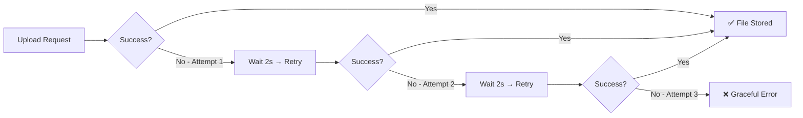

<div align="center">

# αlphα Fílє Shαrє Ɓot

[](https://github.com/utkarshdubey2008/AlphaShare)
[](https://python.org)
[](https://github.com/utkarshdubey2008/Alphashare/blob/main/License)
[](https://github.com/utkarshdubey2008/AlphaShare/stargazers)
[](https://github.com/utkarshdubey2008/AlphaShare/fork)
[](https://github.com/utkarshdubey2008/AlphaShare/issues)
[](https://github.com/utkarshdubey2008/AlphaShare)
[](https://t.me/Thealphabotz)

**A Revolutionary Telegram File Sharing Bot with Quality Upload Mode**

</div>

---

## 📋 Table of Contents

- [What's New in V2.1](#-whats-new-in-v21)
- [Feature Overview](#-feature-overview)
- [Quality Upload Mode](#-quality-upload-mode)
- [Batch Mode](#-batch-mode-enhancements)
- [Technical Improvements](#-technical-improvements)
- [Command Reference](#-complete-command-reference)
- [Installation & Deployment](#️-installation--deployment)
- [Usage Examples](#-usage-examples)
- [Tech Stack](#-tech-stack)
- [Credits](#-credits--acknowledgments)

---

## 🎯 What's New in V2.1



The headline addition in V2.1 is **Quality Upload Mode** — a system that automatically detects and organizes media files by quality tag (resolution or rip type) and produces clean, grouped shareable links with a single command.

---

## 📊 Feature Overview



---

## 🚀 Quality Upload Mode

### How It Works



### Commands

| Command | Alias | Description |
|---------|-------|-------------|
| `/qu` | `/qupload` | Start quality upload mode |
| `/qmode` | — | Toggle filename / caption extraction |
| `/qdone` | `/qud` | Generate quality-grouped links |
| `/qcancel` | — | Cancel quality upload mode |

### Supported Quality Formats

| Category | Supported Values |
|----------|-----------------|
| **Resolutions** | `240p` `360p` `480p` `720p` `1080p` `1440p` `2160p` `4K` |
| **Web Rips** | `WEB-DL` `WEBrip` |
| **HD Rips** | `HDrip` `HD-rip` `HD_rip` `HD.rip` `hdrip` |
| **Disc / Broadcast** | `BluRay` `HDTV` `DVDrip` `TS` `CAM` |

### Example Output

```
1080p  → https://t.me/bot?start=xxx
720p   → https://t.me/bot?start=xxx
480p   → https://t.me/bot?start=xxx
WEBrip → https://t.me/bot?start=xxx
HDrip  → https://t.me/bot?start=xxx
```

---

## 📦 Batch Mode Enhancements

### Episode Sorting Pipeline



**Supported episode patterns:** `E01` · `Episode 01` · `Ep01` · `S01E01` · `[E01]` · `-E01-`

### FloodWait Resume System

When Telegram's FloodWait restriction is triggered mid-batch, the bot saves its exact position in the queue, waits out the restriction, and resumes from the same file — no duplicates, no skipped files, real-time progress displayed throughout.

---

## 🔧 Technical Improvements



| Improvement | Detail |
|-------------|--------|
| **Smart Link Formatting** | All links rendered in monospace; resolutions grouped, rip types listed separately |
| **Retry Logic** | 3 automatic retries with 2-second delays on failed uploads |
| **Command Aliases** | `/qdone` ↔ `/qud` — both work identically |
| **Admin-Only Access** | All batch and quality upload features restricted; unauthorised users receive clear denial messages |

---

## 📋 Complete Command Reference

### 🎬 Quality Upload

```
/qu, /qupload    → Start quality upload mode
/qmode           → Toggle extraction mode (filename / caption)
/qdone, /qud     → Generate quality-grouped links
/qcancel         → Cancel quality upload mode
```

### 📦 Batch Upload

```
/batch           → Start batch mode
/done            → Generate batch link (episode-sorted)
/cancel          → Cancel batch mode
```

### 👑 Admin (Owner Only)

```
/addadmin <user_id>   → Add a new admin
/rmadmin  <user_id>   → Remove admin privileges
/adminlist            → View current admin list
```

### 🛠️ Utility

```
/start           → Start the bot
/help            → Get help information
/stats           → View bot statistics
/short <url>     → Shorten a URL
```

---

## ✨ Core Features

| Feature | Description |
|---------|-------------|
| 🎯 **Quality Upload Mode** | Auto-organizes media by quality with grouped shareable links |
| 📦 **Advanced Batch Mode** | Perfect episode sorting, FloodWait resume, real-time progress |
| 🔐 **Multi-Admin System** | MongoDB-backed admin management with owner-only controls |
| 📊 **Analytics & Tracking** | Real-time download stats, storage analytics, user metrics |
| 🔗 **UUID-based Links** | Unique per-file sharing with download tracking |
| 🗑️ **Auto-Delete** | Configurable automatic deletion for copyright compliance |
| 🔒 **Privacy Mode** | Prevent file forwarding and copying |
| 📡 **Force Subscribe** | Multi-channel force subscription support |
| 📢 **Broadcast System** | Message broadcasting with inline button support |
| 🔗 **URL Shortener** | Built-in URL shortening via `/short` |
| ♾️ **24/7 Uptime** | Koyeb keep-alive mechanism for zero-downtime hosting |
| 📁 **Universal File Support** | All Telegram-supported file types accepted |

---

## 🛠️ Installation & Deployment

### Quick Deploy

<div align="center">

[](https://heroku.com/deploy?template=https://github.com/utkarshdubey2008/AlphaShare)
[](https://youtu.be/2EKt3nVcY6E?si=NKMlRw3qx6eaWjNU)

</div>

### Manual Installation

```bash
# Clone the repository
git clone https://github.com/utkarshdubey2008/AlphaShare.git
cd AlphaShare

# Create and activate a virtual environment
python -m venv venv
source venv/bin/activate        # Linux / macOS
.\venv\Scripts\activate         # Windows

# Install dependencies
pip install -r requirements.txt

# Run the bot
python main.py
```

### Updating to V2.1

> [!IMPORTANT]
> **Sync your fork** before redeploying to receive all V2.1 features.

1. Open your forked repository on GitHub.
2. Click **"Sync fork"** → **"Update branch"**.
3. Redeploy your bot to apply the changes.

---

## 🎓 Usage Examples

### Quality Upload Mode

```
User:  /qu
Bot:   ✅ Quality Upload Mode activated!

User:  [Sends Movie.2024.1080p.WEBrip.mkv]
Bot:   ✅ Detected: 1080p, WEBrip

User:  [Sends Movie.2024.720p.HDrip.mkv]
Bot:   ✅ Detected: 720p, HDrip

User:  /qdone
Bot:   📊 Quality Upload Complete!

       1080p  → https://t.me/bot?start=xxx
       720p   → https://t.me/bot?start=xxx
       WEBrip → https://t.me/bot?start=xxx
       HDrip  → https://t.me/bot?start=xxx
```

### Batch Mode with Episodes

```
User:  /batch
Bot:   ✅ Batch Mode activated!

User:  [Sends Series.S01E03.mkv]
User:  [Sends Series.S01E01.mkv]
User:  [Sends Series.S01E02.mkv]

User:  /done
Bot:   📦 Batch Upload Complete!
       Files sorted: E01 → E02 → E03

       Batch Link: https://t.me/bot?start=batch_xxx
```

---

## 💻 Tech Stack

[](https://python.org)
[](https://github.com/pyrogram/pyrogram)
[](https://www.mongodb.com)
[](https://www.koyeb.com)

| Technology | Role |
|------------|------|
| **Python 3.11.6** | Core runtime |
| **Pyrogram** | Telegram MTProto API framework |
| **MongoDB** | Admin management and file metadata storage |
| **Koyeb** | 24/7 serverless hosting with keep-alive |

---

## 📜 License

This project is licensed under the **[MIT License](https://github.com/utkarshdubey2008/Alphashare/blob/main/License)**.

---

## 🙏 Credits & Acknowledgments

<div align="center">

### 👨‍💻 Developer

**[Utkarsh Dubey](https://github.com/utkarshdubey2008)**
*Main Developer — Alpha Share Bot*

### 🌟 Special Thanks

Contributors, testers, and the Alpha Bots community for continuous support and valuable feedback.

---

### 💬 Join the Community

[](https://t.me/Thealphabotz)

**Stay updated with the latest features and announcements!**

---

Made with ❤️ by [Utkarsh Dubey](https://github.com/utkarshdubey2008)

**⭐ Star this repo if you find it useful!**

</div>
